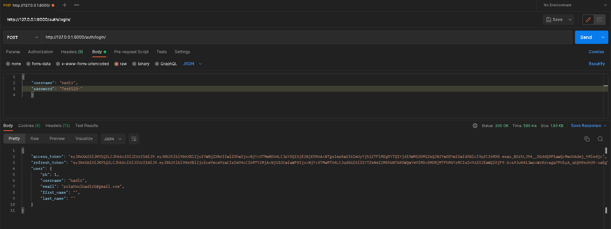

# indiirlmesi gereken

```bash
pip install
pip install django==3.2 django_extensions djangorestframework pillow ipython  dj-rest-auth django-allauth
```

jwt token ile login işlemini araştırdım ama yapamadım.Postman ile ilgili sayfaya istek yaptığımda tokenleri alabiiyorum ancak bu tokenleri kullanarak nasıl giriş yapmam gerektiği anlamadım ve yapamadım

